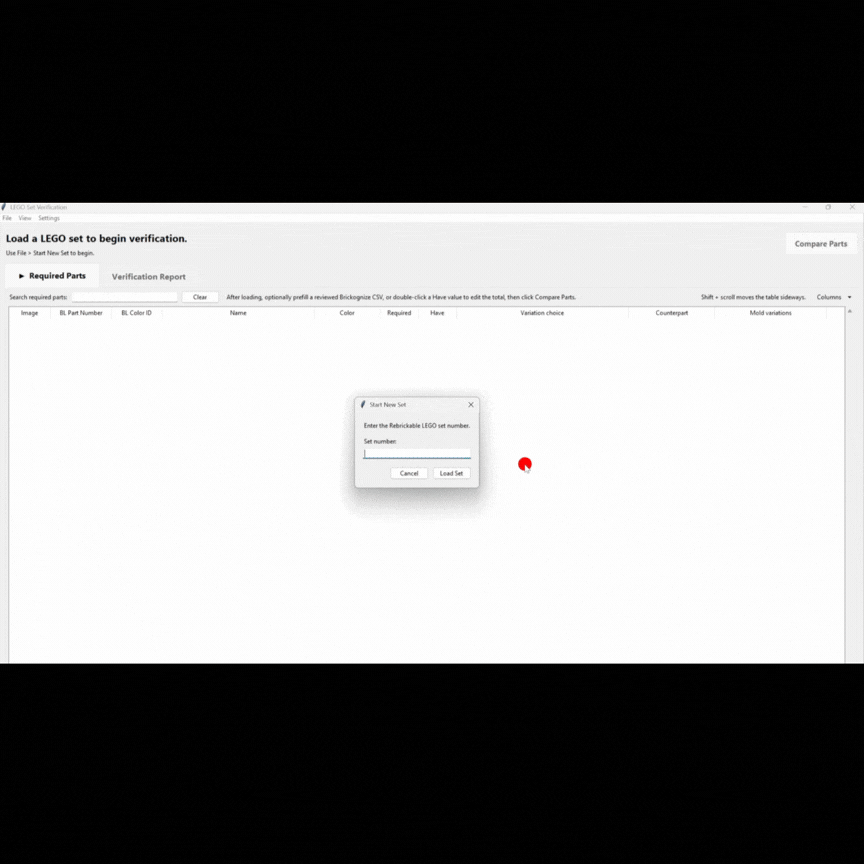
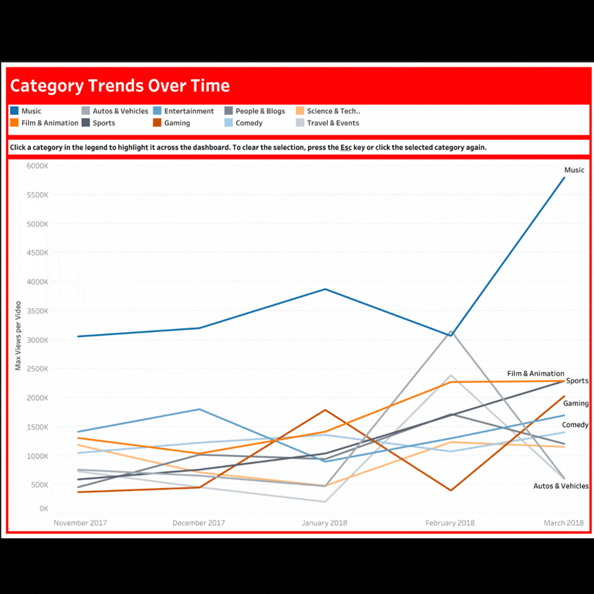
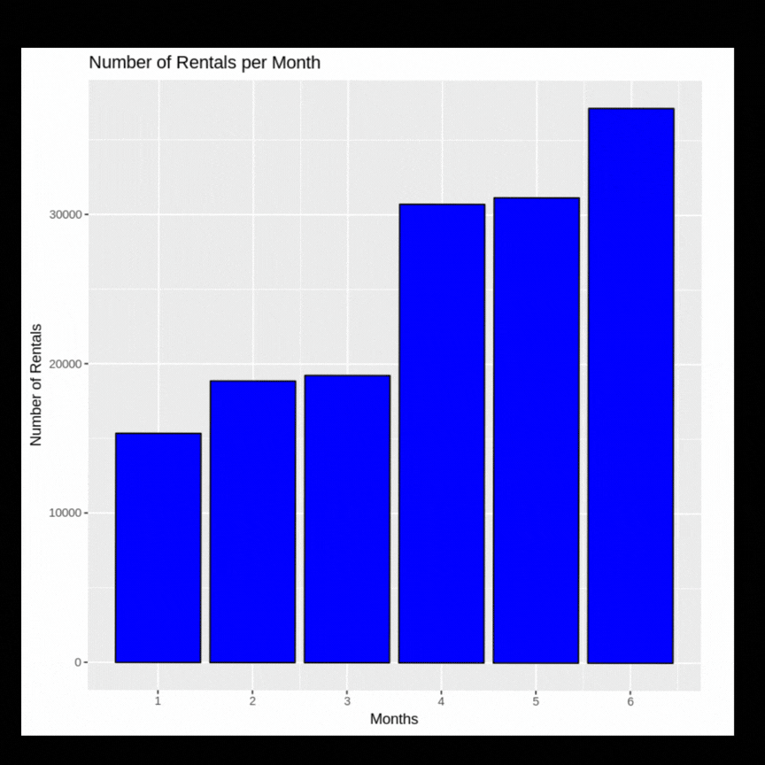

## Hi I'm Yushen!😊👋
**Data Analytics | Python | SQL | Tableau**

A data analytics student with a background in video production, psychology, and hands-on operational work. I'm especially interested in understanding how people and systems work, then using data and technology to make those systems clearer and more useful.

## Featured Projects

### 🧱 LEGO Set Inventory Verification Application

**Python • REST APIs • Tkinter • Data Integration**

Built a Python-based inventory verification workflow application 
for a LEGO resale business during a micro-internship.

The application compares the computer-vision inventory output
against official LEGO set inventories, handles alternate/mold
part relationships, identifies missing pieces, and generates
inventory reports for staff review.

🔒 Source code is private at the client's request.

**Client Feedback**
"Yushen made an outstanding contribution to our LEGO set verification 
project and was responsible for a significant portion of the overall application..."

[View full client feedback](https://wgu.riipen.com/feedbacks/pL42bDGO)

### 📊 YouTube Trending Videos: A Category Analysis 
**Tableau • Data Cleaning • Data Visualization**

Explored U.S. YouTube trending data from November
2017 to March 2018 to understand differences in views, engagement, 
commenting behavior, trending frequency, channels, and categories.

Built an interactive Tableau story with category-level
drilldowns and engagement analysis.

[View the interactive dashboard on Tableau Public](https://public.tableau.com/shared/M8G9HM284?:display_count=n&:origin=viz_share_link)

[View Github Repository & Analysis Decisions](https://github.com/yushenc/youtube-trending-videos-a-category-analysis/blob/main/README.md)

### 💼 Occupational Growth & Skills Analysis 

**Data Integration • Wrangling • Python • Pandas • NumPy • REST API**

Combined and cleaned BLS employment projections and O*NET skills data 
to examine which skills are most important across the ten fastest-growing U.S. 
occupations projected for 2024–2034. 

The project involved API data collection, data-quality assessment, occupation-code 
alignment, dataset integration, and visualization.

[View Analysis](https://github.com/yushenc/occupational-growth-and-skills-analysis-python)

### 🚲 Bikeshare Demand Analysis

**R • Data Wrangling • Exploratory Analysis**

Analyzed bike-sharing trip data to investigate usage patterns
and relationships between rider behavior and trip characteristics.

Performed data cleaning, transformation, and exploratory analysis,
and visualization in R.

[View Analysis](https://github.com/yushenc/bikeshare-demand-analysis-r/tree/main)

## Let's Connect!  
